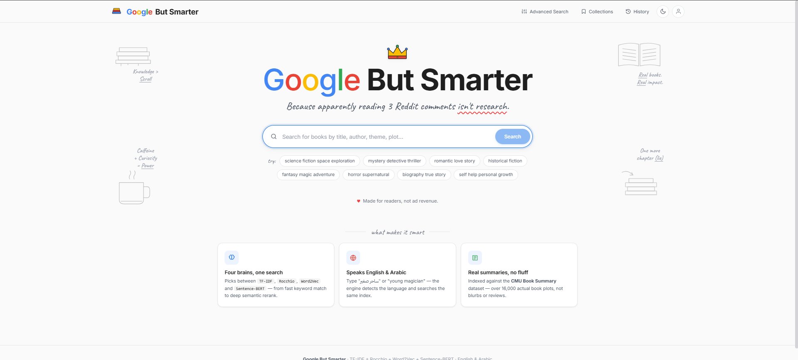

# Google But Smarter (Book Search Engine)

A Flask + (TF‑IDF / Rocchio / Word2Vec / Sentence‑BERT) book search engine with a React (Babel-in-browser) frontend.

## Screenshots



## Run locally

### 1) Python dependencies
Create a virtual environment and install requirements (you may need to install packages matching the script imports).

> Note: this repo currently does not include a `requirements.txt`.

### 2) Start the backend
```bash
python Search_Engine.py
```

The app serves the frontend from `Style.html` and exposes the API on:
- `http://127.0.0.1:5000/api/health`
- `http://127.0.0.1:5000/api/search`

### 3) Open the UI
Open the root URL:
- `http://127.0.0.1:5000/`

## Project structure
- `Search_Engine.py` — Flask backend + search/re-ranking logic
- `Style.html` — frontend UI
- `Search_Engine.png` — screenshot
- `cache/` — generated artifacts (ignored by git)
